# Topical Map - asvabhero.com

Generated: 2026-06-18 19:17
Data source: Ahrefs (via MCP)

```mermaid
flowchart TD

    %% Styling
    classDef pillar fill:#4CAF50,stroke:#2E7D32,color:#fff,font-weight:bold
    classDef cluster fill:#2196F3,stroke:#1565C0,color:#fff
    classDef supporting fill:#FFF,stroke:#9E9E9E,color:#333
    classDef faq fill:#FF9800,stroke:#E65100,color:#fff
    classDef location fill:#9C27B0,stroke:#6A1B9A,color:#fff

    p1["Asvab Practice Test\n(87.4K vol, D:29)"]
    p2["Asvab Scores\n(23.1K vol, D:35)"]
    c2["Asvab Study Guide\n(9.0K vol, D:11)"]
    c1["Asvab Score Chart\n(4.8K vol, D:10)"]
    p2 --> c1
    c3["What Is A Good Asvab Score\n(2.4K vol, D:12)"]
    p2 --> c3
    c6["Is The Asvab Hard\n(1.7K vol, D:0)"]
    p5 --> c6
    c5["Afqt Practice Test\n(1.8K vol, D:12)"]
    p1 --> c5
    c7["Asvab Practice Questions\n(1.6K vol, D:12)"]
    p1 --> c7
    c8["Gt Score\n(1.6K vol, D:11)"]
    p2 --> c8
    c9["Can You Use A Calculator On The Asvab\n(1.5K vol, D:6)"]
    p5 --> c9
    c11["Asvab Tutor\n(1.4K vol, D:18)"]
    p1 --> c11
    c12["How Many Times Can You Take The Asvab\n(1.2K vol, D:7)"]
    p5 --> c12
    c10["Afqt Score\n(1.5K vol, D:26)"]
    p2 --> c10
    c4["Air Force Asvab Score\n(2.2K vol, D:54)"]
    p4 --> c4
    c14["Asvab Arithmetic Reasoning\n(900 vol, D:1)"]
    c2 --> c14
    c17["Navy Asvab Score Chart\n(700 vol, D:1)"]
    p4 --> c17
    c16["How Many Questions Is The Asvab\n(800 vol, D:19)"]
    p5 --> c16
    c22["Afqt Vs Asvab\n(500 vol, D:3)"]
    p2 --> c22
    c18["Asvab Word Knowledge Practice Test\n(600 vol, D:0)"]
    c2 --> c18
    c19["Asvab Math\n(600 vol, D:1)"]
    c2 --> c19
    c20["Afqt Percentile Score\n(600 vol, D:12)"]
    p2 --> c20
    c21["Asvab Mechanical Comprehension\n(500 vol, D:0)"]
    c2 --> c21
    c15["Asvab Waiver\n(900 vol, D:54)"]
    p5 --> c15
    s3["Asvab Flashcards\n(350 vol, D:0)"]
    p1 --> s3
    s1["Asvab Score Chart Army\n(410 vol, D:5)"]
    p4 --> s1
    s4["Asvab Gt Score\n(350 vol, D:0)"]
    p2 --> s4
    s5["Whats The Highest Score On The Asvab\n(350 vol, D:0)"]
    p2 --> s5
    s6["Afqt Predictor Test\n(350 vol, D:2)"]
    p1 --> s6
    s2["Asvab Test Bank\n(400 vol, D:16)"]
    p1 --> s2
    s7["Asvab Math Formulas\n(300 vol, D:0)"]
    c2 --> s7
    s8["What Is A Good Afqt Score\n(250 vol, D:0)"]
    p2 --> s8
    s9["General Science Asvab Study Guide\n(200 vol, D:0)"]
    c2 --> s9
    s10["Electronics Information Asvab\n(200 vol, D:0)"]
    c2 --> s10
    s11["Afct Army\n(200 vol, D:11)"]
    p7 --> s11
    s12["Asvab Composite Scores\n(150 vol, D:2)"]
    p2 --> s12
    s13["General Science Questions\n(150 vol, D:2)"]
    c2 --> s13
    s14["General Technical Asvab Practice Test\n(150 vol, D:35)"]
    p1 --> s14
    s17["Afct Vs Asvab\n(70 vol, D:0)"]
    p7 --> s17
    s15["General Maintenance Asvab\n(90 vol, D:14)"]
    p4 --> s15
    s18["Mechanical Comprehension Asvab Study Guide\n(70 vol, D:0)"]
    c2 --> s18
    s16["Asvab Auto And Shop Study Guide\n(70 vol, D:0)"]
    c2 --> s16
    s19["Afct Calculator\n(70 vol, D:43)"]
    p6 --> s19
    s21["Coast Guard Asvab Score Chart\n(40 vol, D:15)"]
    p4 --> s21
    s23["Asvab Test Format\n(30 vol, D:0)"]
    p5 --> s23
    s20["Afct Practice Test\n(60 vol, D:51)"]
    p7 --> s20
    s22["How To Pass Asvab\n(30 vol, D:1)"]
    p5 --> s22
    s24["Asvab Test Tips\n(10 vol, D:1)"]
    p1 --> s24
    s25["Asvab Reading\n(10 vol, D:0)"]
    c2 --> s25
    p4["Asvab Scores By Branch\n(3.4K vol, D:0)"]
    p5["Asvab Test Basics\n(6.2K vol, D:0)"]
    p6["Asvab Calculator\n(70 vol, D:0)"]
    p7["Afct Active Duty Retest\n(330 vol, D:0)"]
    p6c1["Asvab Calculator\n(0 vol, D:0)"]
    p6 --> p6c1
    s_ao["Assembling Objects Asvab\n(590 vol, D:0)"]
    c2 --> s_ao

    %% Apply styles
    class p1,p2,c2,p4,p5,p6,p7 pillar
    class c1,c3,c6,c5,c7,c8,c9,c11,c12,c10,c4,c14,c17,c16,c22,c18,c19,c20,c21,c15,p6c1 cluster
    class s3,s1,s4,s5,s6,s2,s7,s8,s9,s10,s11,s12,s13,s14,s17,s15,s18,s16,s19,s21,s23,s20,s22,s24,s25,s_ao supporting
```

## Legend

- **Green**: Pillar pages (broad themes, highest authority)
- **Blue**: Cluster pages (subtopics, link to pillar)
- **White**: Supporting pages (specific targets, link to cluster)
- **Orange**: FAQ hubs
- **Purple**: Location template pages
- Numbers: combined search volume / difficulty score
